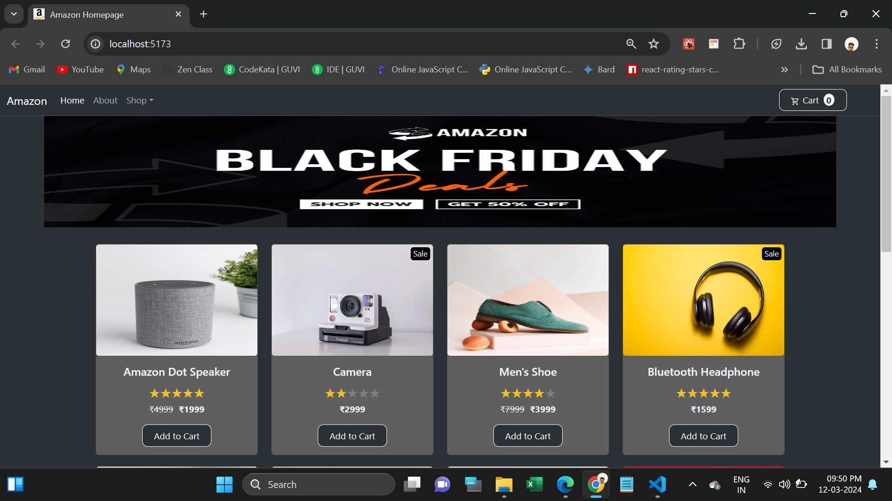

# React Shopping Cart Task

This webpage used to shopping and Add to Cart the product.

When user clicking the Add to cart button it will changed Remove from cart and also added count to cart.

When user again clicking the Remove from cart it will changed Add to cart and also remove count to cart.

  <h4>Used Tools</h4>
<ul>
  <li>Html</li>
  <li>CSS</li>
  <li>Bootstrap</li>
  <li>Javascript</li>
  <li>React JS</li>
</ul>
<h4>Npm Packages are used:</h4>
<ul>
  <li>https://www.npmjs.com/package/react-rating-stars-component</li>
  <li>https://www.npmjs.com/package/react-icons</li>
</ul>
<h3>Deployed URL</h3>
https://ecommerce-shopping-home.netlify.app/

<h5>Screenshots</h5>
1.Main Page

2.Added to Cart Page

